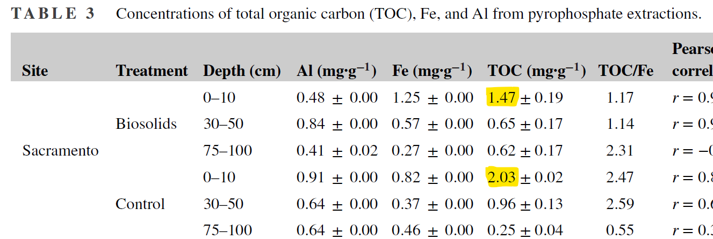

# CarbonGPT prototype

Prototype extracting structured data from soil science papers to build a benchmark dataset.

## Insights

- Converting PDFs to Markdown works well.
- Extracting metadata like study name, authors, location, and year is easy.
- A universal structure is hard to create, and may need iterative refinement.
- Models can confuse similar but distinct measurements.

## Example input and output

Providing a [structure](proto_carbongpt/data_model.py) and a simple prompt allows an LLM to find the relevant table in the PDF and return structured data:

Prompt
```
Extract research paper information. Get all topsoil organic carbon (TOC) measures in weights (e.g., g/kg, mg/g, mg/ha...) from the paper. Also extract changes in TOC over time if available.
```

Input: [Villa 2024](<data/pdfs/Villa et al., 2024.pdf>)


Output excerpt:

```json

{
  "title": "Carbon persistence of soils with long-term biosolids amendments in California agroecosystems",
  "authors": "Yocelyn B. Villa, Eddie Phosalath, Rebecca Ryals",
  "year": 2024,
  "doi": "10.1002/saj2.20632",
  "locations": [
    {
      "name": "Sacramento",
      "location": "Sacramento County, CA",
      "latitude": 38.3351,
      "longitude": -121.1685,
      "measurements": [
        {
          "measurement": "TOC in HF (control)",
          "value": 2.03,
          "measurement_year": "unknown",
          "measurement_depth": "0–10 cm",
          "measurement_unit": "mg/g",
          "group": "control"
        },
        {
          "measurement": "TOC in HF (biosolids)",
          "value": 1.47,
          "measurement_year": "unknown",
          "measurement_depth": "0–10 cm",
          "measurement_unit": "mg/g",
          "group": "treatment"
        }
      ]
    }
  ]
}
```

For more examples of input and output, visit these links:

- [inputs](/workspaces/proto-carbonGPT/data/pdfs)
- [outputs](/workspaces/proto-carbonGPT/data/parsed)
