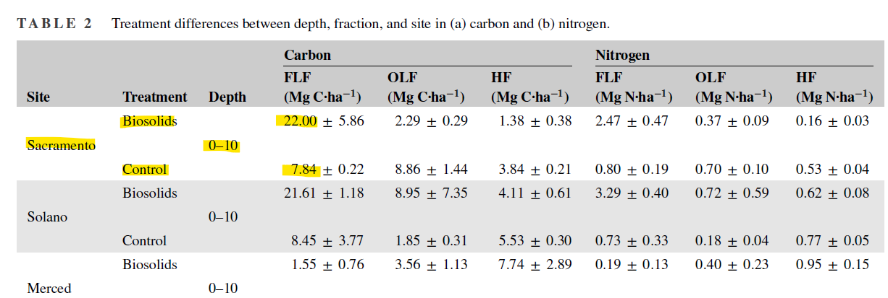
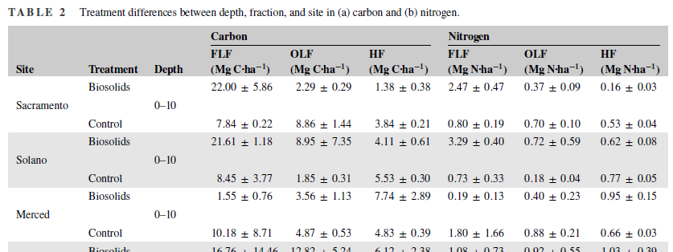
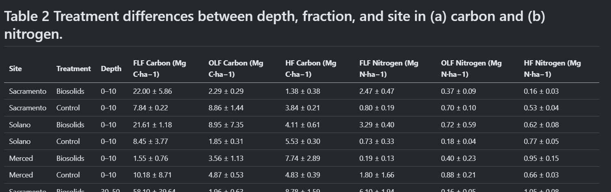

# CarbonGPT prototype

Prototype extracting structured data from soil science papers to build a benchmark dataset for soil system models (e.g., carbon cycles).

## What this prototype can do?

This prototype extracts measurement data and metadata from soil science papers. Example input and output are detailed below.

### Example Input

- [Villa 2024 PDF file](<data/pdfs/Villa et al., 2024.pdf>)

### Example Target Table



### Output excerpt

```json
{
  "title": "Carbon persistence of soils with long-term biosolids amendments in California agroecosystems",
  "authors": "Yocelyn B. Villa, Eddie Phosalath, Rebecca Ryals",
  "year": 2024,
  "doi": "10.1002/saj2.20632",
  "locations": [
    {
      "name": "Sacramento",
      "address": "Sacramento County, CA",
      "latitude": 38.335083,
      "longitude": -121.168472,
      "measurements": [
        {
          "measurement_value": 22.0,
          "measurement_name": "TOC in FLF",
          "measurement_year": "2024",
          "measurement_depth": "0-10 cm",
          "measurement_unit": "Mg C/ha",
          "group": "treatment"
        },
        {
          "measurement_value": 7.84,
          "measurement_name": "TOC in FLF",
          "measurement_year": "2024",
          "measurement_depth": "0-10 cm",
          "measurement_unit": "Mg C/ha",
          "group": "control"
        },
        ... more
      ]
    },
    ... more
  ]
}
```

For more examples, visit these links (continuously updating):

- [inputs](./data/pdfs)
- [outputs](./data/extracted)

## Insights

- Converting PDFs to Markdown works well.
- Extracting metadata like study name, authors, site location, and data collection year is easy.
- A universal structure is hard to create and may need iterative refinement.
- Models can confuse similar but distinct measurements.

## Technical Details

This prototype has 2 steps:

1. Convert PDFs to markdown.
2. Extract structured data.

### Convert PDFs to markdown

We convert PDFs to markdown using `llama_parse`, which performs well for table extraction.

#### Original PDF



#### Preprocessed markdown

|Site|Treatment|Depth|Carbon (Mg C·ha−1)|Carbon (Mg C·ha−1)|Carbon (Mg C·ha−1)|Nitrogen (Mg N·ha−1)|Nitrogen (Mg N·ha−1)|Nitrogen (Mg N·ha−1)|
|---|---|---|---|---|
|Sacramento|Biosolids|0–10|22.00 ± 5.86|2.29 ± 0.29|1.38 ± 0.38|2.47 ± 0.47|0.37 ± 0.09|0.16 ± 0.03|
|Sacramento|Control|0–10|7.84 ± 0.22|8.86 ± 1.44|3.84 ± 0.21|0.80 ± 0.19|0.70 ± 0.10|0.53 ± 0.04|
|Solano|Biosolids|0–10|21.61 ± 1.18|8.95 ± 7.35|4.11 ± 0.61|3.29 ± 0.40|0.72 ± 0.59|0.62 ± 0.08|
|Solano|Control|0–10|8.45 ± 3.77|1.85 ± 0.31|5.53 ± 0.30|0.73 ± 0.33|0.18 ± 0.04|0.77 ± 0.05|
|Merced|Biosolids|0–10|1.55 ± 0.76|3.56 ± 1.13|7.74 ± 2.89|0.19 ± 0.13|0.40 ± 0.23|0.95 ± 0.15|
|Merced|Control|0–10|10.18 ± 8.71|4.87 ± 0.53|4.83 ± 0.39|1.80 ± 1.66|0.88 ± 0.21|0.66 ± 0.03|

#### Human readable markdown render



This preprocessing step is crucial, as parsing directly impacts downstream extraction performance.

### Output structure definitions

We first define a flexible output structure to capture all necessary information, accommodating variations in measurements and data collection sites across studies.

#### Paper structure

A simples `Paper` is defined as follow:

```py
class Paper(BaseModel):
    title: str
    authors: str
    year: int
    doi: str
    locations: list[Location]
```

A paper has title, authors, year, doi, and a list of locations.

#### Location structure

A location is defined as follow:

```py
class Location(BaseModel):
    name: str
    address: str
    latitude: float
    longitude: float
    measurements: list[TopSoilOrganicCarbon | TopSoilOrganicCarbonChange]
```

A location has name, address, latitude, longitude, and a list of measurements

#### Measurement strucutre

There are two types of measurements: change measurements and raw measurements.

```py
class TopSoilOrganicCarbon(BaseModel):
    """Topsoil organic carbon weight measurements."""

    measurement_name: str
    measurement_value: float
    measurement_group: Group
    measurement_year: str
    measurement_depth: str
    measurement_unit: str


class TopSoilOrganicCarbonChange(BaseModel):
    """Change in topsoil organic carbon weight measurements."""

    measurement_name: str
    measurement_change_value: float
    measurement_relative_to: str
    measurement_year: str
    measurement_depth: str
    measurement_unit: str
```

Both measurement types include measurement_name, measurement_year, measurement_depth, and measurement_unit. The `TopSoilOrganicCarbon` measurement has measurement_value and measurement_group (indicating treatment or control group). The `TopSoilOrganicCarbonChange` measurement includes measurement_change_value and measurement_relative_to (indicating the reference point for the change).

#### Group structure

There are two options in the Group: treatment or control.

```py
class Group(StrEnum):
    TREATMENT = auto()
    CONTROL = auto()
```

### Extraction

Providing a [structure](carbongpt/data_model.py) and a simple prompt allows an LLM to find the relevant table in the PDF and return structured data:

Prompt

```txt
Extract research paper information. Get all topsoil (< 20 cm deep) organic carbon (TOC) measurements in the units of mass fractions/concentrations (e.g., g/kg, mg/g, mg/ha...) from the paper. Also, extract changes in TOC over time due to land cover and land use change or long-term treatments if they are available.
```

Code to run the pipeline: [run.py](run.py).
